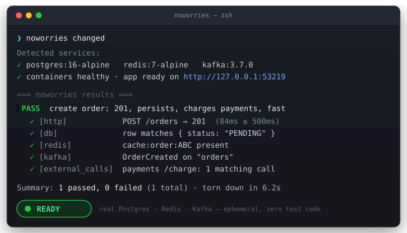
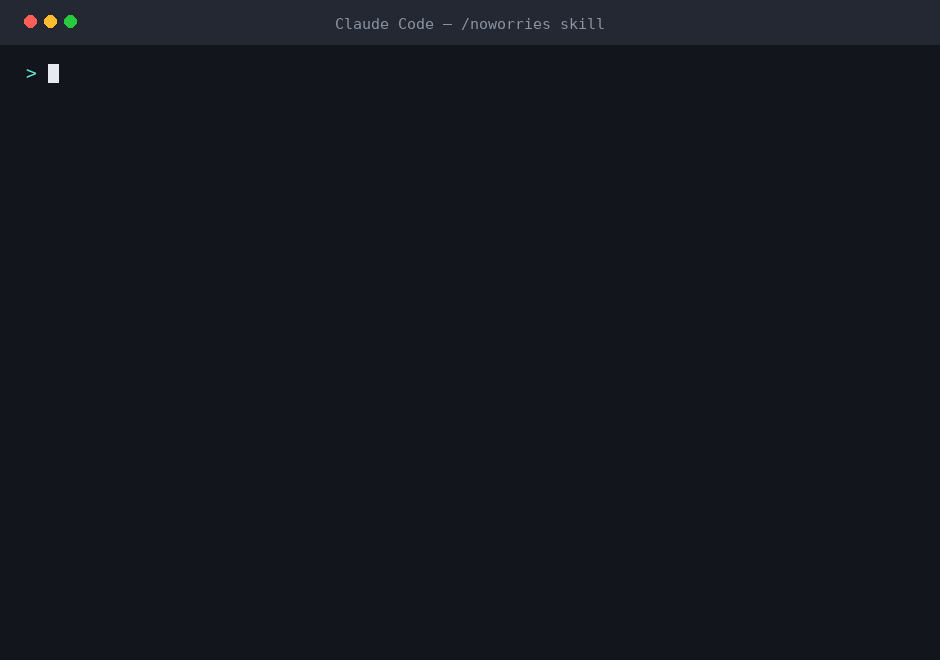

<div align="center">

# noworries

**Let an AI verify the changes it just made — before you find out the hard way.**

[](https://github.com/guvense/noworries/actions/workflows/ci.yml)
[](LICENSE)


`noworries` stands up the real infrastructure a feature needs in throwaway
Docker containers, starts your app against them, exercises the new behaviour end
to end, and reports **READY** or **NOT READY**. Paired with the `/noworries`
command in Claude Code, the AI reads the result and fixes its own code until it's
green — but the binary is standalone: hand-write the `noworries.yml` and run it
in CI or locally, no AI in the loop.

Runs natively on **macOS, Linux, and Windows**.

<br>



**→ [Supported frameworks, services & checks](docs/supported.md)**

</div>

---

## The problem

You ask an AI agent to build a feature. It writes the code. It *looks* right.
But does it actually work end to end — does the endpoint return 201, does the row
land in the database, does the Kafka consumer fire, does the cache get written,
did it call the payment API, is there a stack trace in the log? Usually you find
out later, by hand, or in production.

`noworries` closes that gap. It turns "looks right" into a concrete
**READY / NOT READY** you (and the AI) can act on — with the *actual* services
running, not mocks-of-everything.

## With an AI — or by hand

noworries is built for the **agent loop**, and that's where it earns its keep.
In Claude Code, `/noworries` looks at what the AI just changed, **writes the
`noworries.yml` for it**, runs it, reads the structured `results.json`
(expected-vs-actual per assertion), and **fixes its own code until the run is
READY** — no human in the loop. The spec stays in step with the code because the
same agent that edits the code updates the checks.

You don't need an AI to use it, though — the binary is standalone (there are
**zero AI or network calls when it runs**):

- **By hand.** Write `noworries.yml` yourself. It's a small declarative file
  (services + checks), *not* test code — see [`noworries.yml` at a
  glance](#noworriesyml-at-a-glance). Run `noworries`, read **READY / NOT
  READY**, commit the file, run it in CI. Everything behaves identically; the
  only difference is that *you* author and maintain the YAML.
- **With an AI.** The agent writes that YAML for you, keeps it in sync as the
  code evolves, and closes the fix-and-rerun loop on its own.

Same engine either way. The AI isn't a runtime dependency — it's the thing that
removes the last piece of manual work (writing and updating the spec). Run it
solo and you get a real integration harness; run it under an agent and you get a
hands-off "did my change actually work?" gate. **That autonomous loop is where
the real value is.**

## "Why not just have the AI write Testcontainers tests?"

You can — and for a **permanent regression suite your team owns**, you probably
should. They're different layers: Testcontainers is a library for *writing
integration tests*; noworries is a *verification loop* an AI agent drives to
check the change it just made. Where noworries differs:

- **No test code.** A `noworries.yml` (services + checks), not AI-written
  container/lifecycle/client/teardown code that lives in your repo and can rot —
  or be *green but wrong*, since the AI wrote both the code and the test.
- **The client behaviour is solved once, correctly.** Retries for eventual
  consistency, Kafka topic auto-creation, subset matching — handled by a
  tested tool, not re-derived (and re-broken) in every hand-written test.
- **Black-box, whole-app, language-agnostic.** It starts your *real* app
  (`mvnw`/`dotnet run`/`go run`/`rails`/`artisan`/`uvicorn`/`npm`) and pokes it
  from the outside — one tool whether it's Spring, .NET, Go, Rails, Laravel,
  Django, FastAPI, or Node — instead of a per-language in-process slice test.
- **Built for the agent loop.** `noworries changed` scopes to what was just
  touched; a structured `results.json` (expected-vs-actual per assertion) lets the
  AI parse the failure and self-correct before you review.

Use both: Testcontainers for the committed regression suite, noworries as the
agent's fast "did my change actually work?" gate (you can commit `noworries.yml`
and run it in CI too).

### vs. YAML API testers (Venom, Hurl, Step CI)

Those are excellent *test runners* — you point them at an environment that
already exists and they fire HTTP/DB/etc. steps. noworries owns the whole
environment: it **spins up the ephemeral infra, starts your real app wired to
it, runs the checks, and tears it all down** in one command. So it's
*environment + app + checks*, not checks against an environment you have to
stand up (and clean up) yourself.

## How it works

```
/noworries
   │
   ├─ 1. read what changed            (git diff of the AI's edits)
   ├─ 2. write/update noworries.yml   (services + checks for the feature)
   ├─ 3. spin up infra in Docker      (Postgres/MySQL/Mongo/Redis/Kafka/ES, ephemeral)
   ├─ 4. run setup hooks              (DB migrations / fixtures)
   ├─ 5. start the app against it     (env wired to the containers + externals)
   ├─ 6. run the checks               (HTTP, DB, queue, cache, gRPC, GraphQL, …)
   ├─ 7. report READY / NOT READY     (+ results.json / JUnit / HTML)
   └─ 8. tear everything down
           │
           └─ NOT READY → the AI fixes the code and runs again, until green.
```

Everything is ephemeral: a fresh isolated Docker network per run, guaranteed
`docker compose down -v` teardown on success, failure, or Ctrl-C.

## Example

A single check can span services — HTTP status + latency, a database row, a
downstream call, and the app log, all at once:

```
=== noworries results ===
PASS  create order: 201, persists, charges payments, logs, fast
      ✓ [http]           POST /orders -> 201
      ✓ [http-latency]   POST /orders responded in 84ms (<= 500ms)
      ✓ [db]             first row matches { status: "PENDING" }
      ✓ [external_calls] POST /charge on "payments": 1 matching call(s)
      ✓ [logs]           log contains "OrderCreated"; free of "ERROR"

Summary: 1 passed, 0 failed (1 total)
Result: READY
=========================
```

When something regresses, you get the exact diff:

```
FAIL  create order returns 201 and persists as PENDING
      ✗ [http] POST /orders: expected status 201, got 500
          expected: 201
          actual:   500
      ✗ [db]   expected a matching row, but query returned no rows
Result: NOT READY
```

## Installation

Every method installs the `noworries` binary. The `/noworries` **skill** is
embedded in the binary — install it once with `noworries install-command`, which
writes `SKILL.md` plus its `references/` files to `~/.claude/skills/noworries/`
(globally), or `--project` for a single repo. In Claude Code you then run `/noworries`, or let Claude invoke
it automatically when a change needs verifying (see [Using the skill](#using-the-noworries-skill)).

<details open>
<summary><b>curl | sh</b> (macOS / Linux — no toolchain required)</summary>

```bash
curl -fsSL https://raw.githubusercontent.com/guvense/noworries/main/install.sh | sh
noworries install-command
```

Detects your OS/arch, downloads the prebuilt binary from GitHub Releases, and
verifies the checksum.
</details>

<details>
<summary><b>Homebrew</b> (macOS / Linux)</summary>

```bash
brew install guvense/noworries/noworries
noworries install-command
```
</details>

<details>
<summary><b>npm</b> (macOS / Linux / Windows)</summary>

```bash
npm install -g @guvenseckin4/noworries   # postinstall downloads the prebuilt binary
noworries install-command                # the command is still `noworries`
```
</details>

<details>
<summary><b>Windows</b></summary>

Use **npm** (above), download `noworries-x86_64-pc-windows-msvc.tar.gz` from the
[latest release](https://github.com/guvense/noworries/releases), or build from
source with `cargo install`. **WSL2** works too and behaves like Linux.
</details>

<details>
<summary><b>cargo</b> (build from source, any OS)</summary>

```bash
cargo install --git https://github.com/guvense/noworries
noworries install-command
```
</details>

### Requirements

- **Docker** running (Docker Desktop on macOS / Windows; WSL2 works).
- Your app's own toolchain (e.g. JDK + Maven for Spring Boot, Node, Go, Python).
- Optional: `grpcurl` on PATH for `grpc` checks.
- For `/noworries`: **Claude Code**.

## Quick start

```bash
cd your-project
noworries init          # scaffold a starter noworries.yml
# edit noworries.yml to declare services + checks, then:
noworries               # confirm services, bring infra up, run checks, tear down
```

Or, inside Claude Code, just make a change and run **`/noworries`** — the AI
writes the checks for you, runs them, and fixes the code if they fail. Use
**`/noworries force`** for a full regression pass over everything that changed.

## Using the `/noworries` skill

`noworries install-command` installs `/noworries` as a Claude Code **skill**
(`~/.claude/skills/noworries/`: a short `SKILL.md` entry point plus `references/`
files Claude reads only when it needs them). Because it ships a `description`,
there are two ways it runs:

<div align="center">



</div>

1. **You invoke it** — type `/noworries` after making a change. Claude reads the
   diff, writes/updates `noworries.yml`, stands up the infra, runs the checks,
   and if anything is **NOT READY** it fixes the code and re-runs until green.
   `/noworries force` runs the full suite; `/noworries init` just scaffolds a spec.
2. **Claude invokes it** — when your request implies verification ("make sure
   this endpoint actually works"), Claude can load the skill on its own. Prefer
   to keep the Docker-heavy run manual? Add `disable-model-invocation: true` to
   the skill's frontmatter and it only runs when you type `/noworries`.

Either way the skill is just instructions: it tells Claude *how* to drive the
`noworries` binary. The binary itself has no AI dependency — you can run
`noworries` by hand or in CI with a spec you wrote yourself (see [With an AI — or
by hand](#with-an-ai--or-by-hand)).

## `noworries.yml` at a glance

```yaml
version: 1
services:
  - postgres:16-alpine        # also: timescaledb, cockroachdb, mysql, mariadb, mssql,
                              #       mongodb, redis, kafka, rabbitmq, elastic, opensearch,
                              #       clickhouse, cassandra, scylladb
  - redis

app:                          # optional; auto-detected (Spring/.NET/Go/Rails/Laravel/Django/FastAPI/Node)
  start: "./mvnw spring-boot:run"
  health: "/actuator/health"

setup:                        # optional migrations/fixtures, run before the app
  - "./mvnw -q flyway:migrate"

checks:
  - name: "create order returns 201, persists, caches, is fast"
    tags: [orders]
    request: { method: POST, path: /orders, body: { sku: "ABC123", qty: 2 } }
    expect:  { status: 201, max_ms: 500 }
    db:      { query: "SELECT status FROM orders WHERE sku='ABC123'", expect_row: { status: "PENDING" } }
    redis:   { key: "cache:order:ABC123", expect_exists: true }
```

Full reference: **[docs/configuration.md](docs/configuration.md)** ·
check types: **[docs/checks.md](docs/checks.md)**.

## What it can verify

**Services it stands up** (declare as `kind` or `kind:tag`):
`postgres` · `timescaledb` · `cockroachdb` · `mysql` · `mariadb` · `mssql` ·
`mongodb` · `redis` · `kafka` · `rabbitmq` · `elastic` (7 & 8) · `opensearch` ·
`clickhouse` · `cassandra` · `scylladb` · `smtp` (Mailpit) · `minio` (S3).
Wire-compatible aliases reuse a peer's
provider: `timescaledb` and `mariadb` map onto Postgres/MySQL, `scylladb` onto
Cassandra — same provider/checks, different image. Every service boots with a
Docker healthcheck and exports connection env to the app (`DATABASE_URL`,
`RABBITMQ_URL`, `CLICKHOUSE_DSN`, `CASSANDRA_CONTACT_POINTS`, `SMTP_HOST`,
`S3_ENDPOINT` + `AWS_*`, …). Mail and uploads become assertable: `smtp` sinks
the app's mail for the `email` check, `minio` stores its objects for `s3`.

**Frameworks it auto-detects** (or force with `app.framework`):
Spring Boot · ASP.NET Core · Go · Ruby on Rails · Laravel · Django · FastAPI
(Python) · Node.js. Non-JVM apps get conventional env vars (`DATABASE_URL`,
`REDIS_URL`, `KAFKA_BROKERS`, …); Laravel also gets its native `DB_*` keys.

**Check / assertion types** — combine any of these in one check:

| Area | Types |
| ---- | ----- |
| HTTP | `request` + `expect` (status, `body_contains`, `max_ms` latency) |
| SQL | `db` (Postgres), `mysql` (seed → query), `schema` (column/type diff — PG, MySQL, or SQL Server) |
| NoSQL / cache | `mongodb` (seed → find), `redis` (key/value), `cassandra` (CQL query → `expect_value`/`expect_row`/`expect_rows`, incl. Scylla) |
| Analytics | `clickhouse` (HTTP SQL query → `expect_value`/`expect_row`/`expect_rows`) |
| Streaming | `kafka` (produce / expect_message), `rabbitmq` (queue depth via mgmt API), `sse`, `websocket` |
| Search | `elastic` (template + insert/update/delete + query) |
| APIs | `graphql`, `grpc` (via grpcurl) |
| Observability | `metrics` (Prometheus), `traces` (OpenTelemetry via Jaeger/Tempo), `logs` |
| Contracts | `snapshot` (golden diff), `external_calls` (assert outbound calls to a mock) |

**Beyond single checks:**

- **Edge-case scenarios** — `burst`, `concurrent` (races), `duplicates`
  (idempotency), `out_of_order`, with concurrency, rate limits, and a throughput
  assertion — so data pipelines get tested under load, not just the happy path.
- **Flink pipelines** — stand up an ephemeral Flink session cluster, build +
  submit jobs, and verify a Kafka → process → Postgres → topic → ES flow end to end.
- **External dependencies** — inject a sandbox URL + credentials into the app, or
  stand up an in-process **mock** that records the app's outbound calls.
- **Auth** — log in / bearer / basic / api-key for noworries' own requests.
- **Secrets** — `${VAR}` from a gitignored `.noworries.env`, prompted when missing.
- **Reports** — `--junit` (CI test cases) and `--html` (shareable) alongside
  `results.json`.

## Extending it

Adding a service, framework, edge-case scenario, or check type is a single trait
implementation plus one registry line — no change to the core:

| Add a… | Trait | Where |
| ------ | ----- | ----- |
| Service | `ServiceProvider` | `src/services/` |
| Framework | `Framework` | `src/framework/` |
| Edge-case scenario | `EdgeCase` | `src/edgecases/` |
| Check type | `Assertion` | `src/checks/` |

See **[docs/architecture.md](docs/architecture.md)**.

## Documentation

- **[Supported frameworks, services & checks](docs/supported.md)** — the full compatibility list at a glance.
- **[Getting started](docs/getting-started.md)** — install, first run, the loop.
- **[Configuration](docs/configuration.md)** — the full `noworries.yml` schema.
- **[Checks](docs/checks.md)** — every assertion type with examples.
- **[CLI reference](docs/cli.md)** — commands and flags.
- **[How it works](docs/how-it-works.md)** — lifecycle, env wiring, teardown.
- **[Architecture](docs/architecture.md)** — the extension traits.
- **[Troubleshooting](docs/troubleshooting.md)** — common issues.

## Design notes

- **Plain `docker compose` CLI**, not embedded Testcontainers — so it can run
  standalone from a slash command, not only from a test process.
- **Ephemeral & isolated** — per-run project name and bridge network, `down -v`
  teardown guaranteed via a signal handler + a hard `--timeout`.
- **The CLI is deterministic; the intelligence is in the prompt** — the tool
  reports *what changed* and *what passed/failed*; the `/noworries` command lets
  the AI decide *what to verify* and *how to fix*.
- **Real services in CI** — every external dependency (Kafka, Elasticsearch,
  MySQL, MongoDB, Postgres, Flink) has an integration test against the real
  thing, which is what catches client-library misuse that unit tests can't.

## License

MIT
